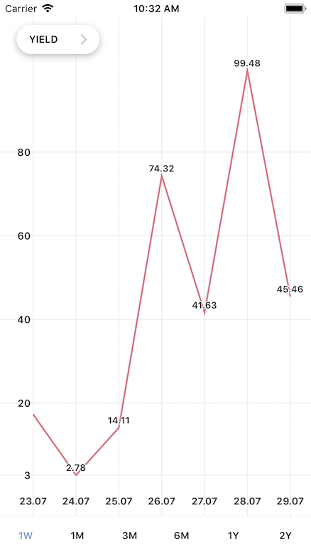

# LineChartViewController

Класс реализует контроллер с графиком, выпадающим списком показателей, горизонтальным списком кнопок с периодами. Вид экземпляра класса необходимо добавить на родительский, задать виду фрейм. Для загрузки данных необходимо присвоить значение isin:

let lineChart = LineChartViewController()
self.view.addSubview(lineChart.view)

lineChart.isin = "12345"

Интерфейс класса.
/// Идентификатор облигации.
public var isin: String?
/// График.
public var lineChart: LineChart!

Внешний вид графика можно настроить в setter lineChart по протоколу LineChartViewPresentable
/// Конфигурация лейб вершин графиков.
open var dotLabels: DotLabels
/// Ширина линии графика.
Open var lineWidth: CGFloat
/// Цвета линий графиков.
open  var colors: [UIColor]
/// Конфигурация значений по оси x.
open var x: Coordinate
/// Конфигурация значений по оси y.
open var y: Coordinate

LineChartViewController состоит из трех UI элементов: 
LineChart – график,
DropListViewController – выпадающий список,
ButtonsViewController – горизонтальный список кнопок.

Каждый элемент можно переиспользовать отдельно от остальных.

Поддерживает landscape.

LineChart

Класс реализует линейный график/графики.

Интерфейс класса LineChartViewPresentable.
/// Конфигурация лейб вершин графиков.
open var dotLabels: DotLabels
/// Ширина линии графика.
open var lineWidth: CGFloat
/// Цвета линий графиков.
open  var colors: [UIColor]
/// Конфигурация значений по оси x.
open var x: Coordinate
/// Конфигурация значений по оси y.
open var y: Coordinate

/// Добавляет данные вершин графика. Рисует график.
/// Можно добавлять более одного массива данных графика.
func addLine(_ data: [CGFloat])
/// Чистит данные, стирает линии.
func clearAll()

DropListViewController

Класс реализует выпадающий список. Список реализован через UITableView. Принимает заголовки строк таблицы через setDataSource: . Сообщает о выбранной строке в selectedRow:

Интерфейс класса DropListPresentable.
/// Шрифт строк.
var textLabelFont: UIFont
/// Сообщит о выбранной строке.
var selectedRow: ((_ row: Int) -> Void)?
/// Максимальная высота открытого списка, чтобы не выйти за границы экрана.
/// Если контент открытой таблицы больше maxHeight, включится скролл таблицы.
var maxHeight: CGFloat?
/// Задает массив строк списка.
func setDataSource(_ source: [String])
/// Закрывает список. Можно вызвать, например, после изменения 
/// ориентации устроства.
func hide()

ButtonsViewController

Класс реализует горизонтальный список кнопок. Список реализован через UIStackView с UIButton. Принимает заголовки кнопок через dataSource: Сообщает о выбранном индексе в selectedIndex:

Интерфейс класса ButtonsPresentable.
/// Заголовки кнопок. Количество кнопок соответсвует количеству 
